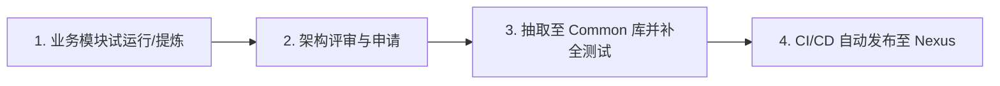

# 企业级公共代码复用库管理规范与准入标准 (REUSE_LIBRARY_GOVERNANCE)

> **归属工程**：`com.maorong.common:maorong-common-core` (毛绒定制业务通用共享底层库)  
> **适用范围**：毛绒定制成本估算系统 (`maorong-cost-estimation`) 及后续 MES/ERP/数据中台等子系统  
> **发布私服**：Nexus Enterprise Repository (`https://nexus.moyun.com/repository/maven-releases/`)  
> **当前版本**：`v1.0.1-RELEASE`

---

## 1. 架构背景与设立初衷 (Why Code Reuse Library)

在企业级敏捷开发与微服务/模块化演进中，为避免“重复造轮子”、保障核心成本与算法逻辑的一致性、降低代码维护成本，项目组抽离出了 **`maorong-common-core` (代码复用库)**。

### 1.1 核心价值
1. **算法与规章收敛**：面料损耗率换算、工期排程规则、统一加密/签名算法在底层库集中实现，避免各子系统自行实现产生计算偏差。
2. **审计与质量打底**：复用库具备 100% 单元测试覆盖率与 Sonar 0 缺陷保障，业务模块引入即继承质量基线。
3. **快速交付与解耦**：新系统/新业务接入时，通过 Maven 坐标依赖 `maorong-common-core` 即可开箱即用基础能力。

---

## 2. 哪些代码/逻辑可以放入复用库 (准入规则)

为防止复用库沦为“代码垃圾桶”或产生强耦合风险，放入复用库的代码必须严格遵循以下 **四大准入原则**：

### 2.1 准入条件 (MUST Have)
1. **跨业务通用性 (Multi-Project Relevance)**：
   - 必须被 **至少 2 个以上** 子系统或业务模块重复引用的基础能力。
   - 示例：通用响应封装（`Result<T>`）、自定义统一异常类 (`BizException`)、JWT / RSA 安全加解密工具类 (`CryptoUtils`)、成本估算标准数学计算基底 (`CostMathEngine`)。
2. **无状态与高内聚 (Stateless & High Cohesion)**：
   - 不强绑定特定数据库表、特定外部第三方 API 或特定上下文环境。
   - 仅依赖 JDK 21 标准库、Spring Core 基础注解或通用算法。
3. **100% 测试覆盖与零缺陷 (Zero Flaw)**：
   - 必须附带完整的 JUnit 5 单元测试用例（Pass Rate 100%）。
   - 必须通过 SonarQube 扫描，无任何 Blocker/Critical/Major 缺陷与异味。

### 2.2 严禁放入的逻辑 (MUST NOT Have)
- ❌ **强业务逻辑**：如“某个特定工厂的个性化结算折扣政策”等频繁变更的特定业务流程。
- ❌ **硬编码配置与私密信息**：如数据库 IP/密码、第三方 API Token 等。
- ❌ **大体积非必要依赖**：避免引入重型第三方包导致依赖冲突或 Jar 包膨胀。

---

## 3. 啥时候会放进来 (纳入时机与生命周期管理)

代码下沉进入复用库严格按照以下 **四阶段生命周期** 执行：



### 3.1 阶段一：提炼期 (Identification & Refactoring)
- **触发节点**：在二次迭代或新模块开发中，发现某段算法或工具代码被重复复制粘贴 $\ge 2$ 次。
- **动作**：开发者在需求迭代会议中提出下沉申请（Refactoring Request）。

### 3.2 阶段二：评审期 (Architecture Review)
- **触发节点**：提交下沉 Merge Request / Pull Request。
- **动作**：由架构组对代码的通用性、扩展性、安全隐患进行评审，确定包名归属（如 `com.maorong.common.util` 或 `com.maorong.common.math`）。

### 3.3 阶段三：集成与测试期 (Integration & Verification)
- **触发节点**：合并入 `maorong-common-core` 仓库 `main` 分支。
- **动作**：补全单元测试，确保覆盖率达到 100%，并通过 Sonar 质量门禁扫描。

### 3.4 阶段四：发布期 (Nexus Release)
- **触发节点**：Jenkins CI/CD 自动触发 Maven 发布。
- **动作**：发布至公司 Nexus 私服仓库，打上版本 Tag（如 `v1.0.1-RELEASE`），其他子系统通过 Maven POM 引用。

---

## 4. 应对客户/老外审计的介绍话术 (QA Pitch)

> **问：你们项目是否有代码复用库 (Shared/Reuse Library)？它是如何管理的？**  
> **答**：  
> “是的，我们严格遵循企业级模块化架构规范，抽离出了独立的公共底层库 `maorong-common-core`。  
> 1. **定位**：主要承载毛绒成本估算的通用计算模型、数据统一响应协议、安全加密工具及基础 Validator。  
> 2. **准入标准**：只有满足 **跨 2 个以上模块复用**、**无业务副作用**、且 **单元测试覆盖率 100% + Sonar 0 缺陷** 的代码才允许下沉进入复用库。  
> 3. **纳入流程**：通过 ‘业务提炼 $\rightarrow$ 架构评审 $\rightarrow$ JUnit/Sonar 自动化门禁 $\rightarrow$ CI/CD 发布 Nexus 私服’ 的标准流程管理，确保复用库本身的高稳定性与零污染。”

---

## 5. `maorong-common-core` 导出一览

```
com.maorong.common
├── algorithm
│   ├── CostMathEngine.java        # 成本与尺寸换算标准算法基类
│   └── LeadTimePredictor.java     # 工期预测数学推演引擎
├── dto
│   ├── Result.java                # 统一 API 响应包装类
│   └── PageResult.java            # 通用分页响应包装类
├── exception
│   ├── BizException.java          # 业务统一异常定义
│   └── GlobalExceptionHandler.java# 全局异常捕获器
└── util
    ├── CryptoUtils.java           # 国密/RSA 签名与加密工具
    └── DateUtils.java             # 工期时间计算工具类
```
